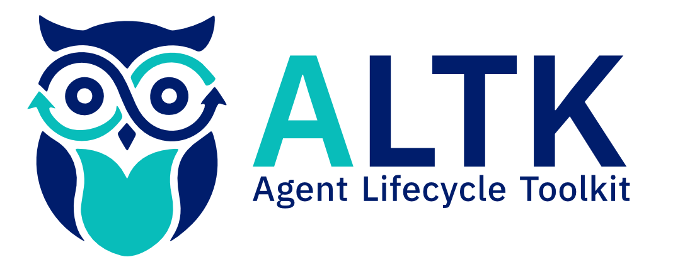
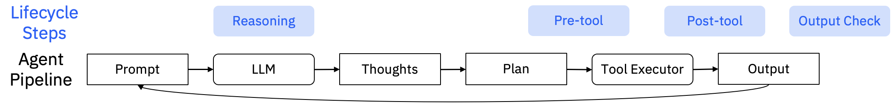

<h1 align="center" >
    
</h1>

<h4 align="center">Delivering plug-and-play, framework-agnostic technology to boost agents' performance</h4>

## What is ALTK?
The Agent Lifecycle Toolkit helps agent builders create better performing agents by easily integrating our components into agent pipelines. The components help improve the performance of agents by addressing key gaps in various stages of the agent lifecycle, such as in reasoning, or tool calling errors, or output guardrails.

<!-- [TODO: improve figure, positioning, etc.]-->



## Installation
To use ALTK, simply install agent-lifecycle-toolkit from your package manager, e.g. pip:

```bash
pip install agent-lifecycle-toolkit
```

More [detailed installation instructions]() are available in the docs.
<!-- [TODO: add link] -->

## Getting Started
Below is an end-to-end example that you can quickly get your hands dirty with. The example has a langgraph agent, a weather tool, and a component that checks for silent errors. Refer to the [examples](examples) folder for this example and others. The below example will additionally require the `langgraph` and `langchain-anthropic` packages along with setting two environment variables.

```python
import random

from langgraph.prebuilt import create_react_agent
from langchain_core.tools import tool
from typing_extensions import Annotated
from langgraph.prebuilt import InjectedState

from altk.post_tool_reflection_toolkit.silent_review.silent_review import SilentReviewForJSONDataComponent
from altk.post_tool_reflection_toolkit.core.toolkit import SilentReviewRunInput, Outcome
from altk.toolkit_core.core.toolkit import AgentPhase

# Ensure that the following environment variables are set:
# ANTHROPIC_API_KEY = *** anthropic api key ***
# ALTK_MODEL_NAME = anthropic/claude-sonnet-4-20250514

@tool
def get_weather(city: str, state: Annotated[dict, InjectedState]) -> str:
    """Get weather for a given city."""
    if random.random() >= 0.500:
        # Simulates a silent error from an external service
        result = {"weather": "Weather service is under maintenance."}
    else:
        result = {"weather": f"It's sunny and 70F in {city}!"}

    # Use SilentReview component to check if it's a silent error
    review_input = SilentReviewRunInput(messages=state["messages"], tool_response=result)
    reviewer = SilentReviewForJSONDataComponent()
    review_result = reviewer.process(data=review_input, phase=AgentPhase.RUNTIME)

    if review_result.outcome == Outcome.NOT_ACCOMPLISHED:
        # Agent should retry tool call if silent error was detected
        return "Silent error detected, retry the get_weather tool!"
    else:
        return result

agent = create_react_agent(
    model="anthropic:claude-sonnet-4-20250514",
    tools=[get_weather],
    prompt="You are a helpful assistant"
)

# Runs the agent
result = agent.invoke(
    {"messages": [{"role": "user", "content": "what is the weather in sf"}]}
)
# Show the final result which should not be that the service is in maintenance.
print(result["messages"][-1].content)
```

<!-- More advanced usage options are available in the [docs](). -->
<!-- [TODO: add link] -->

## Features
<!--[TODO: reread the descriptions and make sure they are easy to understand, clear and consistent in the information and style of writing]
[TODO: move up in the order of sections?] -->

| Lifecycle Step | Component                        | Description                                                                                                                                                                                                                                          |
|----------------|----------------------------------|------------------------------------------------------------------------------------------------------------------------------------------------------------------------------------------------------------------------------------------------------|
| Reasoning      | [Spotlight](altk/spotlight_toolkit)  | SpotLight enables users to emphasize important spans within their prompt and steers the LLMs attention towards those spans. It is an inference-time hook and does not involve any training or changes to model weights.                              |
| Pre-tool       | [Refraction](altk/pre_tool_reflection_toolkit/refraction)   | Verify the syntax of tool call sequences and repair any errors that will result in execution failures                                                                                                                                                |
| Pre-tool       | [SPARC](altk/pre_tool_reflection_toolkit/sparc)      | Evaluates tool calls before execution, identifying potential issues and suggesting corrections or transformations across multiple validation layers.                                                                                                 |
| Post-tool      | [Code Generation for JSON Processing](altk/post_tool_reflection_toolkit/code_generation) | If the agent calls tools which generate complex JSON objects as responses, this component will use LLM based Python code generation to process those responses and extract relevant information from them.                                           |
| Post-tool      | [Silent Error Review](altk/post_tool_reflection_toolkit/silent_review)     | A prompt-based approach to identify silent errors in tool calls (errors that do not produce any visible or explicit error message); Determines whether the tool response is relevant, accurate and complete based on the user's query                |
| Post-tool      | [RAG Repair](altk/post_tool_reflection_toolkit/rag_repair)  | Given a failing tool call, this component attempts to use an LLM to repair the call while making use of domain documents such as documentation or troubleshooting examples via RAG. This component will require a set of related documents to ingest |
| Output Check   | [Policy Guard](altk/policy_guard_toolkit)     | Checks to see if the output from the agent adheres to the policy statement & repair the output if it doesn’t |


## Documentation

Check out ALTK's [documentation](), for details on
installation, usage, concepts, and more (Coming Soon).
<!-- [TODO: add link] -->

The ALTK supports multiple LLM providers and two methods of configuring the providers. For more information, see the [LLMClient documentation](https://github.ibm.com/AI4BA/agent-lifecycle-toolkit/blob/oss/altk/toolkit_core/llm/README.md).

## Examples
Go hands-on with our [examples](examples).
<!-- [TODO: add link] -->

## Integrations
To further accelerate your AI application development, check out ALTK's native
[integrations]() with popular frameworks and tools (Coming Soon).
<!-- [TODO: add link] -->

## Get Help and Support
Please feel free to connect with us using the [discussion section](https://github.com/AgentToolkit/agent-lifecycle-toolkit).

## Contributing Guidelines
ALTK is open-source and we ❤️ contributions.<br>

To help build ALTK, take a look at our: [Contribution guidelines](CONTRIBUTING.md)

## Bugs
We use GitHub Issues to manage bugs. Before filing a new issue, please check to make sure it hasn't already been logged.

## Code of Conduct
This project and everyone participating in it are governed by the [Code of Conduct](CODE_OF_CONDUCT.md). By participating, you are expected to uphold this code. Please read the [full text](CODE_OF_CONDUCT.md) so that you know which actions may or may not be tolerated.
<!-- [TODO: change email for code of conduct] -->

## Legal notice
All content in these repositories including code has been provided by IBM under the associated open source software license and IBM is under no obligation to provide enhancements, updates, or support. IBM developers produced this code as an open source project (not as an IBM product), and IBM makes no assertions as to the level of quality nor security, and will not be maintaining this code going forward.

## License
The ALTK codebase is under Apache 2.0 license.
For individual model usage, please refer to the model licenses in the original packages.

## Contributors
Thanks to all of our contributors who make this project possible. Special thanks to the Global Agentic Middleware team in IBM Research for all of the contributions from the many different teams and people.
