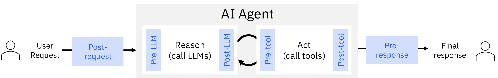

<h1 align="center" >
    
</h1>

<h4 align="center">Delivering plug-and-play, framework-agnostic technology to boost agents' performance</h4>

## What is ALTK?
The Agent Lifecycle Toolkit helps agent builders create better performing agents by easily integrating our components into agent pipelines. The components help improve the performance of agents by addressing key gaps in various stages of the agent lifecycle, such as in reasoning, or tool calling errors, or output guardrails.




## Installation
To use ALTK, simply install agent-lifecycle-toolkit from your package manager, e.g. pip:

```bash
pip install agent-lifecycle-toolkit
```

More [detailed installation instructions]() are available in the docs.
<!-- [TODO: add link] -->

## Getting Started
Below is an end-to-end example that you can quickly get your hands dirty with. The example has a langgraph agent, a weather tool, and a component that checks for silent errors. Refer to the [examples](examples) folder for this example and others. The below example will additionally require the `langgraph` and `langchain-anthropic` packages along with setting two environment variables.

```python
import random

from langgraph.prebuilt import create_react_agent
from langchain_core.tools import tool
from typing_extensions import Annotated
from langgraph.prebuilt import InjectedState

from altk.post_tool.silent_review.silent_review import SilentReviewForJSONDataComponent
from altk.post_tool.core.toolkit import SilentReviewRunInput, Outcome
from altk.core.toolkit import AgentPhase

# Ensure that the following environment variables are set:
# ANTHROPIC_API_KEY = *** anthropic api key ***
# ALTK_MODEL_NAME = anthropic/claude-sonnet-4-20250514

@tool
def get_weather(city: str, state: Annotated[dict, InjectedState]) -> str:
    """Get weather for a given city."""
    if random.random() >= 0.500:
        # Simulates a silent error from an external service
        result = {"weather": "Weather service is under maintenance."}
    else:
        result = {"weather": f"It's sunny and 70F in {city}!"}

    # Use SilentReview component to check if it's a silent error
    review_input = SilentReviewRunInput(messages=state["messages"], tool_response=result)
    reviewer = SilentReviewForJSONDataComponent()
    review_result = reviewer.process(data=review_input, phase=AgentPhase.RUNTIME)

    if review_result.outcome == Outcome.NOT_ACCOMPLISHED:
        # Agent should retry tool call if silent error was detected
        return "Silent error detected, retry the get_weather tool!"
    else:
        return result

agent = create_react_agent(
    model="anthropic:claude-sonnet-4-20250514",
    tools=[get_weather],
    prompt="You are a helpful assistant"
)

# Runs the agent
result = agent.invoke(
    {"messages": [{"role": "user", "content": "what is the weather in sf"}]}
)
# Show the final result which should not be that the service is in maintenance.
print(result["messages"][-1].content)
```

<!-- More advanced usage options are available in the [docs](). -->
<!-- [TODO: add link] -->

## Features
<!--
[TODO: move up in the order of sections?] -->

| Lifecycle Stage | Component                                                              | Purpose |
|-----------------|------------------------------------------------------------------------|------------------------------------------------------------------------------------------------------------------------------------------------------------------------------------------------------------------------------------------------------|
| Pre-LLM         | [Spotlight](altk/pre_llm/spotlight)                                    | Does your agent not follow instructions? Emphasize important spans in prompts to steer LLM attention. |
| Pre-tool        | [Refraction](altk/pre_tool/refraction)              | Does your agent generate inconsistent tool sequences? Validate and repair tool call syntax to prevent execution failures. |
| Pre-tool        | [SPARC](altk/pre_tool/sparc)                        | Is your agent calling tools with hallucinated arguments? Make sure arguments match the tool specs and request semantics. |
| Post-tool       | [JSON Processor](altk/post_tool/code_generation)                                                       | Is your agent overwhelmed with large JSON payloads in its context? Generate code on the fly to extract relevant data in JSON tool responses. |
| Post-tool       | [Silent Error Review](altk/post_tool/silent_review) | Is your agent ignoring subtle semantic tool errors? Detect silent errors in tool responses and assess relevance, accuracy, and completeness. |
| Post-tool       | [RAG Repair](altk/post_tool/rag_repair)             | Is your agent not able to recover from tool call failures? Repair failed tool calls using domain-specific documents via Retrieval-Augmented Generation. |
| Pre-response    | [Policy Guard](altk/pre_response/policy_guard)                              | Does your agent return responses that violate policies or instructions? Ensure agent outputs comply with defined policies and repairs them if needed. |


## Documentation

Check out ALTK's [documentation](https://pages.github.com/AgentToolkit/agent-lifecycle-toolkit/), for details on
installation, usage, concepts, and more.

The ALTK supports multiple LLM providers and two methods of configuring the providers. For more information, see the [LLMClient documentation](https://github.com/AgentToolkit/agent-lifecycle-toolkit/blob/main/altk/toolkit_core/llm/README.md).

## Examples
Go hands-on with our [examples](examples).

## Integrations
To further accelerate your AI application development, check out ALTK's native
[integrations](./docs/integrations.md) with popular frameworks and tools.

## Get Help and Support
Please feel free to connect with us using the [discussion section](https://github.com/AgentToolkit/agent-lifecycle-toolkit).

## Contributing Guidelines
ALTK is open-source and we ❤️ contributions.<br>

To help build ALTK, take a look at our: [Contribution guidelines](CONTRIBUTING.md)

## Bugs
We use GitHub Issues to manage bugs. Before filing a new issue, please check to make sure it hasn't already been logged.

## Code of Conduct
This project and everyone participating in it are governed by the [Code of Conduct](CODE_OF_CONDUCT.md). By participating, you are expected to uphold this code. Please read the [full text](CODE_OF_CONDUCT.md) so that you know which actions may or may not be tolerated.

## Legal notice
All content in these repositories including code has been provided by IBM under the associated open source software license and IBM is under no obligation to provide enhancements, updates, or support.

## License
The ALTK codebase is under Apache 2.0 license.
For individual model usage, please refer to the model licenses in the original packages.

## Contributors
Thanks to all of our contributors who make this project possible. Special thanks to the Global Agentic Middleware team in IBM Research for all the contributions from the many different teams and people.
