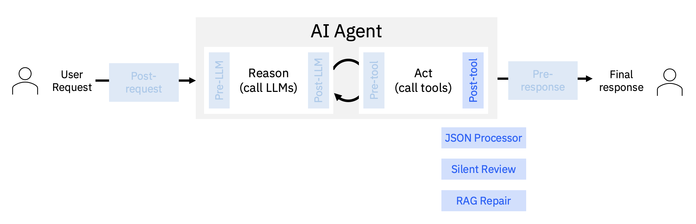

# Post-tool Stage
This stage occurs after a tool is called (whether the tool call was successful or not).

ALTK includes the following components for this stage:
- [silent review](./silent_review)
detects silent errors in tool responses and assess relevance, accuracy, and completeness.
- [JSON processor](./code_generation)
generates code on the fly to extract relevant data in JSON tool responses.
- [RAG repair](./rag_repair)
repairs failed tool calls using domain-specific documents via Retrieval-Augmented Generation.
