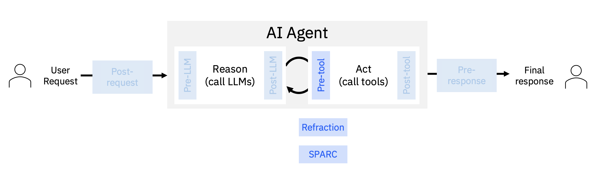

# Pre-tool Stage
This stage is triggered before a tool is called by the agent.

ALTK includes two components in this stage:
- [Refraction](./refraction)
a low-cost (no LLMs!), low-latency, domain-agnostic, data-agnostic, model-agnostic approach towards validation and repair for a sequence of tool calls, based on classical AI planning techniques
- [SPARC](./sparc)
evaluates tool calls before execution, identifying potential issues and suggesting corrections or transformations across multiple validation layers.
