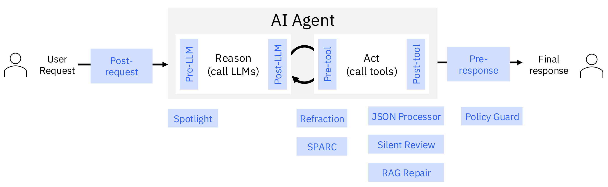

# ALTK Components
We summarize the components currently in ALTK in the table below.

| Lifecycle Step | Component                             | Problem | Description | Performance                                                                                                              | Resources                                                       |
|----------------|---------------------------------------|---------|---------|--------------------------------------------------------------------------------------------------------------------------|-----------------------------------------------------------------|
| Pre-LLM        | [Spotlight](./spotlight.md)           | Agent does not follow instructions in the prompt. | SpotLight enables users to emphasize important spans within their prompt and steers the LLMs attention towards those spans. It is an inference-time hook and does not involve any training or changes to model weights. | 5 and 40 point accuracy improvements                                                                                     | [Paper](https://arxiv.org/pdf/2505.12025)                       |
| Pre-tool       | [Refraction](./refraction.md)         | Agent generates inconsistent tool sequences. | Verify the syntax of tool call sequences and repair any errors that will result in execution failures. | 48% error correction                                                                                                     |                                                              |
| Pre-tool       | [SPARC](./sparc.md)                   | Agent calls tools with incorrect or hallucinated arguments. | Evaluates tool calls before execution, identifying potential issues and suggesting corrections or transformations across multiple validation layers. | +15% improvement on GPT-4 model accuracy on function calling                                                             |                                                              |
| Post-tool      | [JSON Processor](./json-processor.md) | Agent gets overwhelmed with large JSON payloads in its context. | If the agent calls tools which generate complex JSON objects as responses, this component will use LLM based Python code generation to process those responses and extract relevant information from them. | +3 to +50 percentage point gains observed across 15 model from various families and sized on a dataset with 1298 samples | [Paper](), [Demo](https://ibm.box.com/v/altk-json-processor-demo) |
| Post-tool      | [Silent Review](./silent-review.md) | Tool calls return subtle semantic errors that aren’t handled by the agent. | A prompt-based approach to identify silent errors in tool calls (errors that do not produce any visible or explicit error message); Determines whether the tool response is relevant, accurate and complete based on the user's query | 4% improvement observed in end-to-end agent accuracy                                                                     |                                                              |
| Post-tool      | [RAG Repair](./rag-repair.md)         | Agent isn’t able to recover from tool call failures. | Given a failing tool call, this component attempts to use an LLM to repair the call while making use of domain documents such as documentation or troubleshooting examples via RAG. This component will require a set of related documents to ingest | 8% improvement observed on models like GPT-4o                                                                            |                                                                 |
| Pre-Response   | [Policy Guard](./policy-guard.md)     | Agent returns responses that violate policies or instructions. | Checks to see if the output from the agent adheres to the policy statement & repair the output if it does not | +10 point improvement in accuracy                                                                                        |                                                             |
