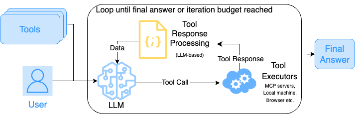
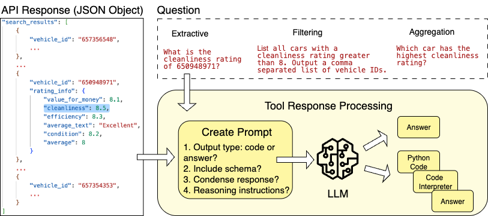
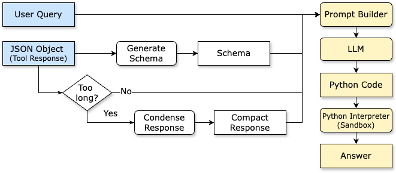
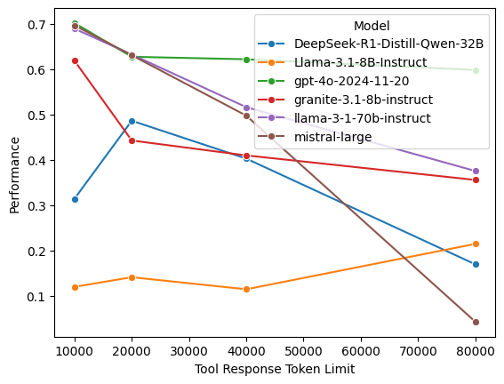
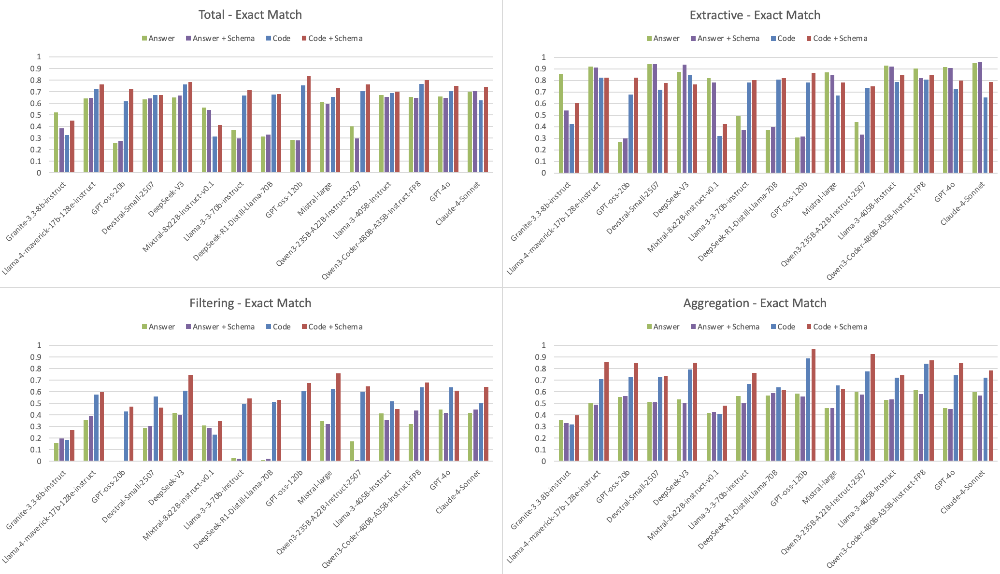

# JSON Processor: Code Generation for JSON Tool Response Processing

If the agent calls tools which generate complex JSON objects as responses, this component will use LLM based Python code generation to process those responses and extract relevant information from them.

See a demo of this component in action [here](https://ibm.box.com/v/altk-json-processor-demo)

## Overview
The most common pattern for tool calling is to call a tool that returns some information. The agent then needs to process the tool response and extract the information from it. This information may be required either to respond back to the user or for the next step of the agent. When the tool responses are in JSON format, and the agent knows what information is needed from it, the code generation component prompts a LLM to generate Python code for parsing the JSON and extracting the required information. It executes the generated code and returns back the extracted content if the code execution succeeds.

The figures below show the flow of tool calling with the code generation based JSON processor component:





## Architecture
The figure below shows how the JSON processor component processes the tool response to get the answer i.e. the information from the JSON object by calling an LLM using a prompt that includes the JSON response and a natural language query.

Given a user query and a tool response (as a JSON object), we
1. generate a schema from the JSON object (see and example below) using existing Python libraries such as genson,
2. determine if the response can fit in the prompt, and
3. if it is too long, we condense the response using a heuristic algorithm.

We construct the prompt with the above inputs and pass it to an LLM that generates Python code to process the JSON object (see example below). The generated code is executed by a Python interpreter in a sandbox (for security reasons) to generate the final answer to the user's query.



#### Sample Schema
    ```python
    schema = {
        "rating_info":{
            "type": "object",
            "properties": {
                "no_of_ratings":{ "type": "number" },
                "dropoff_time":{ "type": "number" },
                "location":{ "type": "number" },
                "cleanliness": { "type": "number" }
            }
        }
   }
    ```

#### Sample LLM generated Python code
   ```
   python\ndef get_cleanliness_rating(api_response):\n    if not isinstance(api_response, dict):\n        return ""\n    \n    data = api_response.get("data")\n    if not isinstance(data, dict):\n        return ""\n    \n    search_results = data.get("search_results")\n    if not isinstance(search_results, list):\n        return ""\n    \n    for result in search_results:\n        if not isinstance(result, dict):\n            continue\n        \n        vehicle_id = result.get("vehicle_id")\n        if vehicle_id and str(vehicle_id).strip().lower() == "650948971":\n            rating_info = result.get("rating_info")\n            if isinstance(rating_info, dict):\n                cleanliness = rating_info.get("cleanliness")\n                if cleanliness is not None:\n                    return str(cleanliness)\n    \n    return ""\n
   ```


### Interface
This component expects the following inputs and generates the following outputs.

#### Input
1. `nl_query`: this is the natural language description (of datatype `str`) hinting at what information needs to be extracted from the response. It can be the agent's thought corresponding to the tool call or the user query directly.

    Example: `What is the cleanliness rating of 650948971?`

2. `tool_response`: this is the JSON object from the tool (of datatype `Any`). A portion of the JSON response is shown below.

    Example:
    ```python
     json_response = {
         "search_results": [
             {
                 "vehicle_id": "657356548",
                 ...
             },
             {
                  "vehicle_id": "650948971",
                   "rating_info": {
                         "value_for_money": 8.1,
                         "cleanliness": 8.5,
                         "efficiency": 8.3,
                         "average_text": "Excellent",
                         "condition": 8.2,
                         "average": 8
                     }
               }
         ]
     }
    ```

#### Output
1. `answer`: this is the final obtained by executing the generated Python code on the JSON object.

    Example: `8.5` (based on the example above)

## Results
We evaluate our approach on a question-answer (QA) dataset containing 1298 samples (580 extractive, 394 filtering and 324 aggregation).

Models' performance degraded as the JSON response increased in length, as shown in the figure below.



Across model families and sizes, adopting our JSON processor (red bars in the figure below) approach leads to accuracy gains ranging from +3% to +50% depending on the model compared to adopting a direct prompting approach that prompts the model to generate answer directly.

Additional results are reported in [1].




## Getting Started
Refer to this [README](https://github.com/AgentToolkit/agent-lifecycle-toolkit/blob/main/altk/post_tool_reflection_toolkit/code_generation/README.md) for instructions on how to get started with the code.
See an example in action [here](https://github.com/AgentToolkit/agent-lifecycle-toolkit/blob/main/examples/json_processor_getting_started.ipynb).

## References
[1] Kate, K., et al., "How Good Are LLMs at Processing Tool Outputs?," arXiv preprint arXiv: (2025).
<!-- TODO: add link to arxiv paper -->

[2] Kate, K., et al. "LongFuncEval: Measuring the effectiveness of long context models for function calling." arXiv preprint arXiv:2505.10570 (2025). https://arxiv.org/pdf/2505.10570
