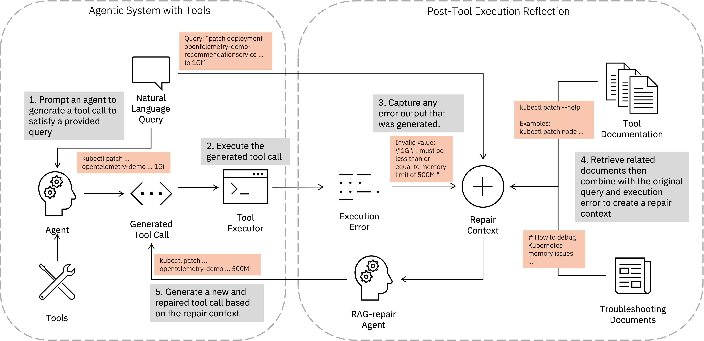
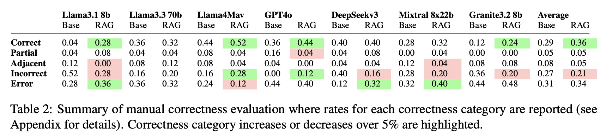

# RAG Repair
Given a failing tool call, this component attempts to use an LLM to repair the call while making use of domain documents such as documentation or troubleshooting examples via RAG. This component will require a set of related documents to ingest.

## Overview
The most common pattern for tool calling is to call a tool that returns some information. The agent then needs to process the tool response and extract the information from it. This information may be required either to respond back to the user or for the next step of the agent. Tool calls may fail for any number of reasons and resolution may require knowledge of the state of the external tool as well as domain knowledge. This tool attempts to use both types of knowledge to repair tool calls by using the tool call response along with retrieving related documentation via RAG.

## Architecture
The figure below shows how the RAGRepair component creates a repair context from the query, tool execution input and result, and related documents from RAG.

For now, the default retrieval method is using sentence embeddings along with Chroma with an option to use BM25 instead. Other storage methods may be considered in the future.

### Interface

#### Input format
This component expects documents to be provided in a local path. Optionally, documents can be divided into manual pages/documentation in a `man` folder and other documents such as troubleshooting documents in a `doc` folder. If these folders are not provided, then all documents are considered non-documentation. Nested folders are supported for ingesting. Supported files are: `pdf`, `html`, `json`, `jsonl`.

The class `post_tool_reflection_toolkit.core.toolkit.RAGRepairRunInput` expects three main inputs as follows:

1. `messages`: List[BaseMessages], a list of messages from the agent, this is optional but will be used to infer the task at hand if `nl_query` is not provided.

2. `tool_call`: str, this is the tool call generated by the agent.

3. `nl_query`: str (optional), this is the natural language description of the task at hand, the agent should be using this to generate a tool call. Takes priority over `messages`.

4. `error`: str (optional), this is the response from the tool, expected to describe what the error is.

5`original_function`: function (optional), this is the original tool that was called, if provided will re-call the tool with the repaired command.

#### Output format
The output is a `RAGRepairRunOutput` object with the following three properties:

1. `new_cmd`: str, the repaired tool call.

2. `retrieved_docs`: str, a block of text aggregating all the retrieved documents used.

3. `result`: str, the result of re-calling the original tool with the new command. Will only be filled if `original_function` is given.

## Results
This component has been evaluated on a set of kubectl commands. The table below details a manual evaluation on how often this component correctly repairs failing kubectl commands.

## Getting Started
Refer to this [README](https://github.com/AgentToolkit/agent-lifecycle-toolkit/blob/main/altk/post_tool_reflection_toolkit/rag_repair/README.md) for instructions on how to get started with the code.

See an example in action [here](https://github.com/AgentToolkit/agent-lifecycle-toolkit/blob/main/examples/rag_repair.ipynb).
