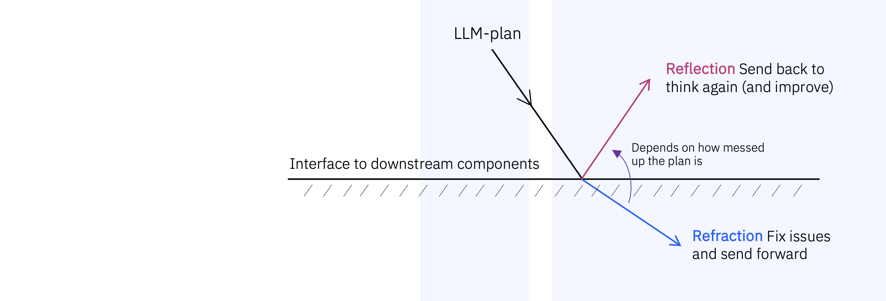
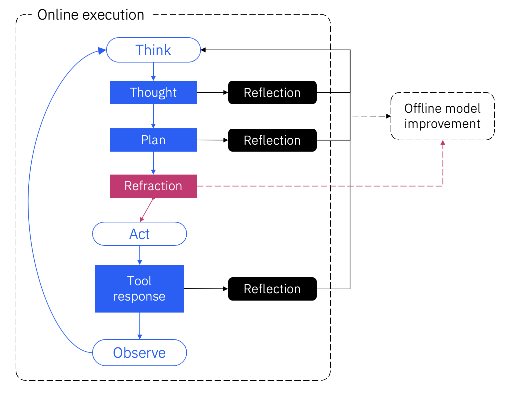
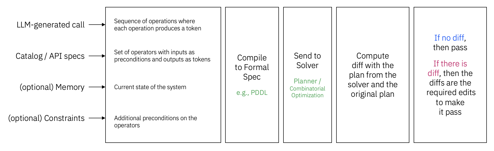
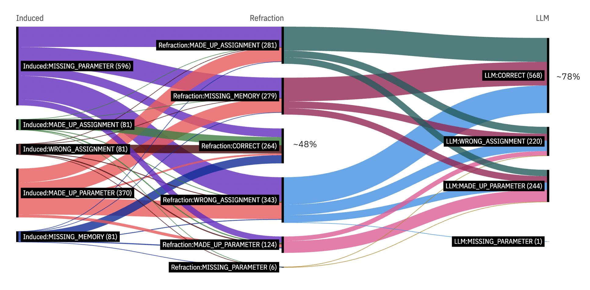

# Refraction



[//]: # ()

Refraction is a low-cost (no LLMs!), low-latency, domain-agnostic, data-agnostic, model-agnostic
approach towards validation and repair for a sequence of tool calls, based on classical AI planning techniques.

The process of **refraction** accepts an LLM response and makes appropriate
edits to it before passing it off to a downstream applications (in contrast to **reflection**,
where we send back the response for the LLM to reason with again).

Compared to the reasoning step, this process must be:

1. **Quick**, in relation to the reasoning step itself; and
2. **With certain guarantees**, since we are passing on the input to downstream applications.

In the context of agentic systems, refraction appears as a middleware component
to be executed between the generation and the execution of a tool call, as well as offline to
improve model performance based on cached refraction outputs.

{width=50%}

[//]: # ()

## Overview

The refraction API allows an agentic system to validate a tool call or a sequence of tool calls
against a reference specification and memory. The whole process works on two simple but key ideas:

> 💡 A large section of issues with tool calls is already identifiable from the specification of
> the tool (and an operating memory in the context of a sequential execution of multiple tools) without trying
> to execute it, or sending it back again to a large model for reflection.

> 💡 Planning and validating at the sequence level, while not necessary, significantly saves on costs,
> latency, and on occasions, accuracy of agentic systems rather than doing so one step at a time.

## Architecture

To find out if there are any issues with a sequence of tool calls, we cast the debugging task
into an optimization process. Consider the following sequence.

```
var2 = SkyScrapperSearchAirport(query="London")
var3 = SkyScrapperFlightSearch(originSkyId="$var1.skyId$", ..., date="2024-08-15")
```

We can extract a series of tokens describing the following different aspects of this sequence:

1. SkyScrapperSearchAirport is called with the parameter `query`.
2. The parameter `query` has been assigned to "London" which has, presumably, come from the user.
3. The output of the call to SkyScrapperSearchAirport is assigned to `var2`.
4. SkyScrapperFlightSearch is called with parameters `originSkyId`, ..., `date`.
5. The parameter `originSkyId` is assigned to the key `skyId` of `var1` produced previously in the sequence.
6. And so on so forth.

> 💡 Given a sequence of API calls, we extract all such tokens. Then the task of the optimizer
> is: **Given the specification of those APIs, enforce as many of the tokens as possible**.

In order to achieve this, we use your favorite [NL2Flow package](https://pypi.org/project/nl2flow) to
check the extracted tokens for soundness i.e. if the tokens represent a valid sequence of API calls.
Check the [validator API of NL2Flow](https://github.com/IBM/nl2flow/wiki/14.-Validator-API) for more details on this.



[//]: # ()

## Results

As mentioned before, since this is a validator with guarantees, if there is a structural issue in a sequence of
tools calls, it will find it -- subject to [[coverage](refraction/01.-Refraction-Examples.md#what-it-does)].
Thus, a passing the validation is a necessary condition for the validity of a series of tool calls.

Passing the YES call is not sufficient, because the values assigned to the parameters may turn out to be incorrect,
in which case the tool call will fail even while being syntactically correct. Furthermore, the fix suggested with
a NO signal may not itself be sufficient to make a valid call. This phenomenon is illustrated below.



[//]: # ()

Exactly what percentage of calls will go onto the second stage depends on the model and the domain.
For example,

- One-shot performance of llama-3-70b shows 25/82 success rate for the whole sequence, and 92/226 successful tool calls
overall, in the [NESTFUL dataset](refraction/06.-Refraction-on-NESTFUL.md).
- Above compared to 100/254 incorrect tool calls in a ReWOO/llama-3.1-70b setup, with ReAct mode identifying 20 less
issues out of 82 trajectories with less thrashing ([compression rate](refraction/07.-Offline-Analysis.md#73-compression-vs-refraction) of 0.13 versus 0.15).

For scaling characteristics, see [here](refraction/05.-Scaling.md).

## Getting Started

1. Examples and Coverage [[link](refraction/01.-Refraction-Examples.md)]
2. Details about the refraction API [[link](refraction/02.-The-Refraction-API-%7C-Inputs-and-Outputs.md)]
3. Refraction as a tool decorator [[link](refraction/03.-The-Refraction-API-%7C-Tool-Calling.md)]
4. Cost-model of refraction as an optimization problem [[link](refraction/04.-Cost-Model-of-Edits.md)]
5. Scaling characteristics [[link](refraction/05.-Scaling.md)]
6. Offline API [[link](refraction/07.-Offline-Analysis.md)]

Refer to this [README](https://github.com/AgentToolkit/agent-lifecycle-toolkit/blob/main/altk/pre_tool_reflection_toolkit/refraction/README.md) for instructions on how to get started with the code.

## References

If you end up using this code, you can cite us using the following BibTex entry. Our general focus on natural language processing pipelines for workflow construction applications is documented in that paper.

```
@inproceedings{chakraborti2022natural,
  title={From Natural Language to Workflows: Towards Emergent Intelligence in Robotic Process Automation},
  author={Tathagata Chakraborti and Yara Rizk and Vatche Isahagian and Burak Aksar and Francesco Fuggitti},
  booktitle={BPM RPA Forum},
  year={2022},
}
```
