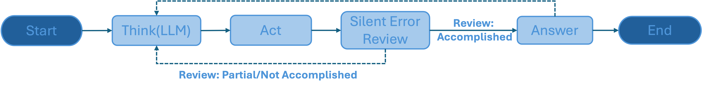

# Silent Review
A prompt-based component to automatically identify silent errors in tool calls - errors that do not produce explicit error messages.

It evaluates whether a tool's response is relevant, accurate, and complete relative to the user’s query.

## Overview

Silent Review is designed to be integrated into agent pipelines to assess tool outputs, particularly for:
- Verbose outputs: Responses that are long or complex.
- Tabular outputs: Structured data that requires context-aware evaluation.

The component analyzes the tool response based on:
1. User query
2. Tool response
3. Tool specification (Optional)
4. Tool input
5. Tool type

It returns one of three outcomes:
1. Accomplished – The tool fully satisfies the user query.
2. Partially Accomplished – The tool partially satisfies the user query.
3. Not Accomplished – The tool fails to satisfy the query.

## Architecture
Silent Review works by prompting a large language model (LLM) to evaluate the tool response in the context of the user’s query and the tool’s specification.

Integration into an agent pipeline is straightforward:

**Key points:**
- Works for any structured or JSON-like tool response.
- Can be plugged post-tool execution in an agent pipeline.
- Uses the LLM to reason about relevance, completeness, and correctness.

## Results
Silent Review improves the overall reliability of agent tool calls by catching silent errors that would otherwise go unnoticed.

**Evaluation Dataset**

The evaluation results are based on the BIRD dataset, which includes SQL databases, natural language questions created by human annotators, and corresponding ground-truth SQL queries. This dataset is designed to evaluate large language models' ability to execute tool calls effectively.

For more details, refer to the paper: [Invocable APIs derived from NL2SQL datasets for LLM Tool-Calling Evaluation](https://arxiv.org/pdf/2506.11266)

**Evaluation Metrics:**
- Micro Win Rate: Average performance across individual data subsets.
- Macro Win Rate: Overall performance across all samples in all subsets.

| Method               | Micro Win Rate (%) | Micro Avg. Loop | Macro Win Rate (%) | Macro Avg. Loop |
|---------------------|:----------------:|:----------------:|:----------------:|:----------------:|
| React without Review | 6.8          | 8.72           | 6.1          | 8.51           |
| React with Review    | 12.7          | 7.77           | 10.4          | 7.90           |

**Insights:**
- Adding Silent Review nearly doubles the micro win rate, indicating more queries are fully or partially accomplished.
- Average loop counts decrease slightly, showing that fewer iterations are needed to reach successful query completion.

## Getting Started
Refer to this [README](https://github.com/AgentToolkit/agent-lifecycle-toolkit/blob/main/altk/post_tool_reflection_toolkit/silent_review/README.md) for instructions on how to get started with the code.
See an example in action [here]( https://github.com/AgentToolkit/agent-lifecycle-toolkit/blob/main/examples/silent_review.ipynb).
