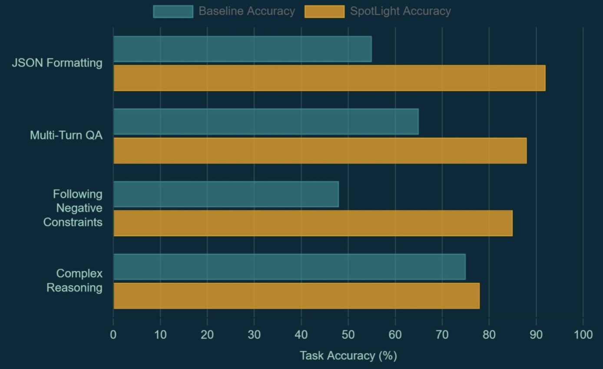

# Spotlight
SpotLight enables users to emphasize important spans within their prompt and steers the LLMs attention towards those spans.

## Overview
SpotLight is an inference-time lifecycle component that lets you "highlight" critical instructions, dynamically steering the model's attention without any retraining.
SpotLight only works with locally loaded HuggingFace Transformer models.

## Architecture
Given a user prompt with a critical instruction, this component will boost the attention score of the highlighted instruction. This allows the LLM to follow that specific instruction given its higher attention score.

## Results
The bar graphs below show how SpotLight leads to improved end to end performance of LLMs.

## Getting Started
Refer to this [README](https://github.com/AgentToolkit/agent-lifecycle-toolkit/blob/main/altk/spotlight_toolkit/README.md) for instructions on how to get started with the code. See an example in action [here](https://github.com/AgentToolkit/agent-lifecycle-toolkit/blob/main/examples/spotlight.ipynb)

## References
Venkateswaran, Praveen, and Danish Contractor. "Spotlight Your Instructions: Instruction-following with Dynamic Attention Steering." arXiv preprint arXiv:2505.12025 (2025). https://arxiv.org/pdf/2505.12025
